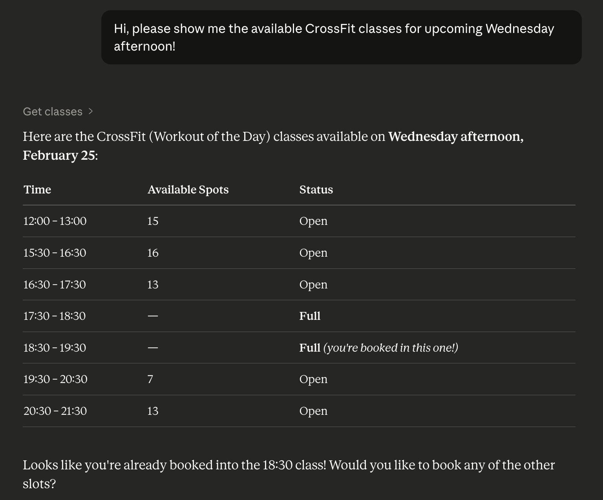

# 🏋️‍♀️ Huppa CLI

A CLI tool and [MCP](https://modelcontextprotocol.io/) server for [Huppa](https://huppa.app) — browse gym classes, book them, and manage bookings from the command line or through AI assistants like Claude.

<p align="center">
  
</p>

> **Disclaimer:** This is an unofficial, community-built project and is **not affiliated with, endorsed by, or approved by Huppa**. It interacts with Huppa's public API using your personal credentials. Use at your own risk — the author is not responsible for any account restrictions, data loss, or other consequences. Huppa may change their API at any time, which could break this tool without notice.

## ⚙️ Installation

**Prerequisites:** Python 3.11+, [Poetry](https://python-poetry.org/)

```bash
git clone https://github.com/maxzw/huppa-cli.git
cd huppa-cli
poetry install

# Run one-time interactive setup (stores credentials in OS keychain)
poetry run huppa auth setup
```

### 🔑 Authentication

The setup command prompts for email/password/subdomain and stores them securely in your system keychain.

To find your subdomain, open your Huppa gym page URL and use the first part before `.huppa.app`.

Example: `https://mygym.huppa.app/me` → subdomain is `mygym`

```bash
poetry run huppa auth setup   # interactive credential setup
poetry run huppa auth whoami  # show current authenticated user
poetry run huppa auth logout  # clear stored credentials
```

Profile-specific authentication:

```bash
HUPPA_PROFILE=work-gym poetry run huppa auth setup
HUPPA_PROFILE=work-gym poetry run huppa auth whoami
```

Environment-variable authentication:

```bash
HUPPA_EMAIL="you@example.com" \
HUPPA_PASSWORD="your-password" \
HUPPA_SUBDOMAIN="mygym" \
poetry run huppa classes 2026-03-08
```

## 🛠️ CLI Usage

All commands output structured JSON.

```bash
# List classes for a date
huppa classes 2026-03-08

# List classes for multiple dates
huppa classes 2026-03-08 2026-03-09

# Show upcoming bookings
huppa bookings
huppa bookings --filter past --per-page 10

# Show memberships
huppa memberships

# Book a class (use organization_id and occurrence_id from `huppa classes`)
huppa book <organization_id> <occurrence_id>

# Cancel a booking
huppa cancel <organization_id> <occurrence_id>

# Waitlist management
huppa waitlist join <organization_id> <occurrence_id>
huppa waitlist leave <organization_id> <occurrence_id>

# Show all available commands
huppa --help
```

## 🤖 MCP Server

The CLI includes a built-in MCP server for AI assistants:

```bash
huppa mcp
```

### Connecting to Claude Desktop

Add the following to your Claude Desktop config file (`~/Library/Application Support/Claude/claude_desktop_config.json` on macOS):

```json
{
  "mcpServers": {
    "huppa": {
      "command": "/path/to/bin/huppa",
      "args": ["mcp"]
    }
  }
}
```

Replace `/path/to/bin/huppa` with the full path to your `huppa` executable (`which huppa`).

Poetry mode:

```json
{
  "mcpServers": {
    "huppa": {
      "command": "/full/path/to/poetry",
      "args": ["--directory", "/absolute/path/to/huppa-cli", "run", "huppa", "mcp"]
    }
  }
}
```

If you use Poetry mode, prefer the full path to `poetry` rather than `"poetry"` because Claude Desktop may start MCP servers with a limited `PATH`.

### MCP Tools

| Tool | Description |
|---|---|
| `get_classes(date)` | List available gym classes for a given date (`YYYY-MM-DD`). |
| `get_classes_multiple_dates(list_of_dates)` | Get classes for multiple dates at once. |
| `book_class(organization_id, occurrence_id)` | Book a class. |
| `cancel_booking(organization_id, occurrence_id)` | Cancel an existing booking. |
| `join_waitlist(organization_id, occurrence_id)` | Join the waitlist for a full class. |
| `leave_waitlist(organization_id, occurrence_id)` | Leave the waitlist. |
| `get_my_bookings(filter, per_page, page)` | List bookings and waitlists. |
| `get_memberships()` | Get memberships with credit balance and payment dates. |

## 📋 License

[MIT](LICENSE)
